# WorkTrack Pro
### Smart Workforce Management System — Backend Engineering Blueprint

**Document Type:** Enterprise Backend Architecture & Development Guide
**Audience:** Backend Engineers, Solution Architects, QA Engineers, DevOps Engineers, Technical Product Owners
**Status:** Living Document — Official Blueprint for Backend Development
**Scope:** This document defines *what* to build and *why*. It intentionally contains **no source code or implementation** — it is the architectural and functional contract that implementation must conform to.

---

## Table of Contents

1. [Project Overview](#1-project-overview)
2. [Problem Statement](#2-problem-statement)
3. [Solution](#3-solution)
4. [Business Objectives](#4-business-objectives)
5. [System Objectives](#5-system-objectives)
6. [Roles & Permissions](#6-roles--permissions)
7. [Technology Stack](#7-technology-stack)
8. [System Architecture](#8-system-architecture)
9. [Backend Folder Structure](#9-backend-folder-structure)
10. [Database Design](#10-database-design)
11. [Entity Relationships](#11-entity-relationships)
12. [API Documentation](#12-api-documentation)
13. [Authentication](#13-authentication)
14. [Employee Module](#14-employee-module)
15. [Attendance Module](#15-attendance-module)
16. [Leave Module](#16-leave-module)
17. [Task Module](#17-task-module)
18. [Notifications](#18-notifications)
19. [Analytics](#19-analytics)
20. [Security](#20-security)
21. [Testing](#21-testing)
22. [Deployment](#22-deployment)
23. [Sprint Plan](#23-sprint-plan)
24. [Coding Standards](#24-coding-standards)
25. [Git Workflow](#25-git-workflow)
26. [Future Enhancements](#26-future-enhancements)

---

## 1. Project Overview

**WorkTrack Pro** is an enterprise-grade **Workforce Management Platform** designed to help organizations of any size — from single-branch SMBs to multi-branch, multi-department enterprises — manage their workforce digitally, accurately, and in real time.

The platform unifies five traditionally fragmented HR/Ops functions into a single backend system:

| Domain | What it replaces |
|---|---|
| Attendance & GPS tracking | Biometric-only or manual registers |
| Leave management | Paper forms / email approvals |
| Task & work assignment | Spreadsheets, WhatsApp groups |
| Daily reporting | Verbal or informal status updates |
| Analytics & audit | Manually compiled MIS reports |

The backend described in this document is the **system of record** for the entire platform. It owns business logic, data integrity, security, multi-tenancy boundaries (Company → Branch → Department → Employee), notification delivery, and reporting/analytics computation. Mobile and web clients are treated as consumers of this backend via versioned REST APIs and WebSocket channels — they hold no independent business logic.

**Project Classification:** Enterprise HRMS / Workforce Management Platform / Employee Productivity System

**Primary Consumers of this Backend:**
- Android/iOS field-employee mobile app (attendance, GPS, tasks, reports)
- Web-based Admin/HR console (company setup, approvals, analytics)
- Internal scheduled jobs (attendance auto-closure, leave accrual, notification digest)

---

## 2. Problem Statement

Organizations — particularly those with field or distributed staff — consistently face the following operational problems:

| # | Problem | Impact |
|---|---|---|
| 1 | **Manual attendance** (registers, spreadsheets) | Error-prone, easy to falsify, no real-time visibility |
| 2 | **Paper-based leave requests** | Slow approvals, lost records, no audit trail, inconsistent leave balance tracking |
| 3 | **No real-time employee location tracking** | Managers cannot verify field staff are where they claim to be; no geofencing |
| 4 | **No centralized task management** | Work assignments live in chat apps or verbally; nothing is trackable or measurable |
| 5 | **No productivity insights** | Leadership cannot see attendance trends, task completion rates, or department performance |
| 6 | **Lack of audit logs** | No accountability for who changed what data, when, and why — a compliance risk |
| 7 | **Communication gaps** | Announcements and policy changes don't reliably reach all employees |
| 8 | **Difficulty managing multiple departments/branches** | No structured hierarchy; permissions and reporting lines are informal |
| 9 | **Poor reporting** | MIS reports are manually compiled, delayed, and error-prone |

These problems compound in organizations with **field employees** (sales, delivery, field service, construction) where physical presence cannot be verified by a fixed biometric device.

---

## 3. Solution

WorkTrack Pro's backend directly addresses each problem above:

| Problem | WorkTrack Pro Solution |
|---|---|
| Manual attendance | GPS-validated check-in/check-out APIs with geofence enforcement, stored as immutable attendance logs |
| Paper leave requests | Structured leave request/approval workflow with configurable leave types, balances, and multi-level approval state machine |
| No real-time tracking | GPS coordinates captured at check-in/out, validated server-side against branch geofence radius using the Haversine formula |
| No task management | Task entity with assignment, priority, status, comments, and attachments, fully queryable per employee/department |
| No productivity insights | Analytics module aggregating attendance %, task completion %, and leave utilization into dashboard-ready endpoints |
| No audit logs | A dedicated `audit_logs` table + AOP-based interceptor records every mutating action (who, what, when, before/after state) |
| Communication gaps | Announcement module + real-time WebSocket + Firebase Cloud Messaging push notifications |
| Multi-branch/department complexity | First-class `Company → Branch → Department → Designation → Employee` hierarchy with role-scoped data access |
| Poor reporting | Daily Work Reports + scheduled report generation + dashboard APIs consumed directly by the frontend, no manual compilation |

The backend is built as a **modular monolith** (see [Section 8](#8-system-architecture)) — a single deployable Spring Boot application, internally organized so that each business domain (Attendance, Leave, Task, etc.) is a cleanly separated module, permitting future extraction into microservices if scale demands it.

---

## 4. Business Objectives

| Objective | Description |
|---|---|
| **Reduce administrative overhead** | Automate attendance, leave, and reporting to reduce HR/Admin manual effort by an estimated 60–70% |
| **Increase workforce accountability** | GPS-verified attendance and task tracking create a verifiable record of work |
| **Enable data-driven decisions** | Give leadership real-time dashboards instead of monthly retrospective reports |
| **Support multi-branch growth** | Allow a company to onboard new branches/departments without backend redesign |
| **Ensure compliance & auditability** | Maintain immutable audit trails suitable for internal/external audits |
| **Improve employee experience** | Simple check-in/out, transparent leave balances, clear task assignments |

## 5. System Objectives

**Technical Objectives**
- Expose a well-versioned, consistent REST API (`/api/v1/...`) consumable by web and mobile clients.
- Enforce strict separation of concerns via layered architecture (Controller → Service → Repository).
- Keep business logic entirely server-side; clients are presentation-only.

**Scalability Goals**
- Stateless application layer (JWT-based auth, no server-side session) to allow horizontal scaling behind a load balancer.
- Redis-backed caching for read-heavy, low-volatility data (roles, permissions, company/branch metadata).
- Database designed with indexing strategy to keep attendance/task queries performant as row counts grow into the tens of millions.

**Maintainability Goals**
- Clear module boundaries so a new engineer can locate and modify a feature without cross-cutting the whole codebase.
- DTO/Entity separation so persistence changes never leak into API contracts.
- Centralized exception handling and validation to avoid duplicated error-handling logic.

**Security Goals**
- Zero trust between client and server: every request re-validated server-side (auth, authorization, business rules).
- Defense-in-depth: input validation, parameterized queries, RBAC, rate limiting, encrypted secrets, HTTPS-only transport.

**Performance Goals**
- P95 API latency under 300ms for standard CRUD/read endpoints under expected load.
- Attendance check-in/out endpoint optimized as the highest-traffic, highest-priority path (target P95 < 200ms).
- Asynchronous processing (notifications, report generation) offloaded from the request thread via schedulers/queues.

---

## 6. Roles & Permissions

WorkTrack Pro implements **Role-Based Access Control (RBAC)** with a hierarchical role model. Each role inherits a scoped view of the data hierarchy `Company → Branch → Department → Employee`.

| Role | Scope | Description |
|---|---|---|
| **Super Admin** | Platform-wide (all companies) | Manages tenant companies, platform-level settings, system health, cross-company analytics. Exists for the platform operator, not a customer employee. |
| **Company Admin** | Single company (all branches) | Owns company setup: branches, departments, designations, company-wide settings, all employees within the company. |
| **HR Manager** | Single company | Manages employee lifecycle (onboarding/offboarding), leave policy configuration, leave approvals, attendance corrections, compliance reporting. |
| **Manager** | Assigned department(s)/team | Approves leave for direct reports, assigns and reviews tasks, views team attendance and daily reports, sends team announcements. |
| **Employee** | Self only | Checks in/out, applies for leave, views own tasks and history, submits daily reports, receives notifications. |

### Permission Matrix (representative — full matrix maintained in `permissions` table)

| Capability | Super Admin | Company Admin | HR Manager | Manager | Employee |
|---|:---:|:---:|:---:|:---:|:---:|
| Manage companies | ✅ | ❌ | ❌ | ❌ | ❌ |
| Manage branches/departments | ❌ | ✅ | ⚠️ view | ❌ | ❌ |
| Create/deactivate employees | ❌ | ✅ | ✅ | ❌ | ❌ |
| Approve leave | ❌ | ✅ | ✅ | ✅ (own team) | ❌ |
| Apply leave | ❌ | ✅ | ✅ | ✅ | ✅ |
| Assign tasks | ❌ | ✅ | ✅ | ✅ (own team) | ❌ |
| Check-in / check-out | ❌ | ✅ | ✅ | ✅ | ✅ |
| View company-wide analytics | ✅ | ✅ | ✅ | ⚠️ team-scoped | ❌ |
| Modify system settings | ✅ | ⚠️ company-scoped | ❌ | ❌ | ❌ |
| View audit logs | ✅ | ✅ | ⚠️ read-only | ❌ | ❌ |

Permissions are **not hardcoded** to roles in application code; they are persisted in `roles` and `permissions` tables with a `role_permissions` join table, allowing Company Admins to customize permission sets per role without a code deployment (see [Section 10](#10-database-design)).

---

## 7. Technology Stack

Every technology below is chosen deliberately, not by default. Rationale is provided so future architectural reviews can validate whether the reasoning still holds.

| Technology | Purpose | Why this choice |
|---|---|---|
| **Java 21 (LTS)** | Core language | Long-Term Support release; virtual threads (Project Loom) improve throughput for I/O-bound workloads like ours (DB calls, external GPS/geocoding calls) without the complexity of reactive programming. |
| **Spring Boot 3** | Application framework | Industry-standard, mature ecosystem, native support for Jakarta EE 10, first-class observability (Actuator/Micrometer), fastest hiring/onboarding curve for enterprise Java teams. |
| **Spring Security** | AuthN/AuthZ framework | Battle-tested filter-chain security model; integrates natively with JWT, method-level `@PreAuthorize` RBAC, and CSRF/CORS configuration. |
| **Spring Data JPA** | Data access abstraction | Reduces boilerplate repository code; consistent transaction management via `@Transactional`; integrates with Flyway for schema versioning. |
| **Hibernate** | ORM implementation | The de-facto JPA provider; mature second-level caching, lazy-loading control, and native query escape hatches for reporting queries. |
| **PostgreSQL** | Primary relational database | ACID-compliant, excellent support for geospatial queries (via `earthdistance`/`PostGIS` if needed for geofencing), JSONB for semi-structured settings, mature and free. |
| **Flyway** | Database migration/versioning | Every schema change is a reviewable, version-controlled SQL migration — critical for an enterprise system with audit obligations. No "schema drift" between environments. |
| **Redis** | Caching & ephemeral state | Sub-millisecond reads for role/permission lookups, rate-limiting counters, and refresh-token/session blacklists — without hitting Postgres on every request. |
| **WebSocket (STOMP over SockJS)** | Real-time channel | Powers live notification delivery and (optionally) live attendance status to admin dashboards, without polling. |
| **Firebase Cloud Messaging (FCM)** | Mobile push notifications | Industry standard for reliable push delivery to Android/iOS even when the app is backgrounded/killed — WebSocket alone cannot guarantee this. |
| **Docker** | Containerization | Guarantees environment parity between dev, staging, and production; simplifies onboarding (`docker compose up`). |
| **Docker Compose** | Local multi-service orchestration | Spins up Postgres, Redis, and the app together for local development and CI integration tests. |
| **Swagger / OpenAPI 3** | API documentation | Auto-generated, always-in-sync API contract that both frontend and QA teams consume directly; also enables contract testing. |
| **Gradle** | Build tool | Faster incremental builds than Maven at this project's scale; Kotlin DSL gives type-safe build scripts. |
| **JUnit 5** | Unit testing framework | Standard for the JVM; parameterized tests are used extensively for business-rule validation (e.g., leave balance edge cases). |
| **Mockito** | Test mocking framework | Isolates service-layer unit tests from database/external dependencies. |
| **Google Maps Platform APIs** (Geocoding / Distance Matrix) | Location intelligence | Used server-side to reverse-geocode check-in coordinates into human-readable addresses for reports, and to validate geofence distances alongside the Haversine calculation. |


---

## 8. System Architecture

### 8.1 Architectural Style

WorkTrack Pro backend is a **Modular Monolith** built on **Layered (N-Tier) Architecture**, internally organized along **Clean Architecture** boundaries. This choice is deliberate:

- A microservices split at day one would add operational overhead (service discovery, distributed transactions, network latency between attendance/leave/task modules that are highly coupled by the `Employee` entity) without a corresponding scale justification.
- Internal modules are still strictly decoupled via package boundaries and interfaces, so extraction into microservices later (e.g., splitting Notifications into its own service) is a refactor, not a rewrite.

### 8.2 Layered Architecture

| Layer | Responsibility | Depends on |
|---|---|---|
| **Controller** | HTTP concern only: request mapping, DTO binding, delegating to service, mapping response codes | Service layer (interface) |
| **Service (interface) / ServiceImpl** | Business logic, transaction boundaries, orchestration across repositories | Repository layer, Mapper |
| **Repository** | Data access via Spring Data JPA | Entity layer |
| **Entity** | JPA-mapped persistence model | — |
| **DTO** | API request/response contracts | — (mapped to/from Entity via Mapper) |
| **Mapper** | Entity ⇄ DTO transformation (MapStruct-style, hand-authored or generated) | Entity, DTO |

**Why separate DTO from Entity?** Entities reflect the database schema; DTOs reflect the API contract. Coupling them means every schema change becomes an API breaking change, and it risks leaking persistence-only fields (e.g., password hashes, internal flags) to clients. This is a non-negotiable rule in this project.

### 8.3 Design Patterns & Principles Applied

| Pattern/Principle | Where applied | Why |
|---|---|---|
| **Repository Pattern** | Data access layer | Abstracts persistence technology from business logic; enables swapping/mocking in tests |
| **DTO Pattern** | All API boundaries | Decouples API contract from internal schema |
| **Dependency Injection** | Constructor injection everywhere (no field injection) | Testability, immutability, explicit dependencies |
| **SOLID — Single Responsibility** | Each service owns exactly one domain (AttendanceService never touches Leave logic) | Limits blast radius of change |
| **SOLID — Open/Closed** | Notification channel strategy (Push/WebSocket/Email) implemented via a common interface | New channels added without modifying existing dispatch logic |
| **SOLID — Liskov/Interface Segregation** | Service interfaces are role-specific, not "god interfaces" | Consumers depend only on methods they use |
| **SOLID — Dependency Inversion** | Controllers depend on Service *interfaces*, not implementations | Enables mocking, future re-implementation |
| **Strategy Pattern** | Geofence validation strategies (circular radius vs. polygon, future) | Extensible without touching AttendanceService core logic |
| **Builder Pattern** | Complex DTO construction (e.g., DashboardResponse) | Readability for multi-field aggregation objects |
| **Observer/Event-driven** | Domain events (e.g., `LeaveApprovedEvent`) trigger notification dispatch | Decouples the leave workflow from notification delivery mechanics |

### 8.4 High-Level Component Diagram

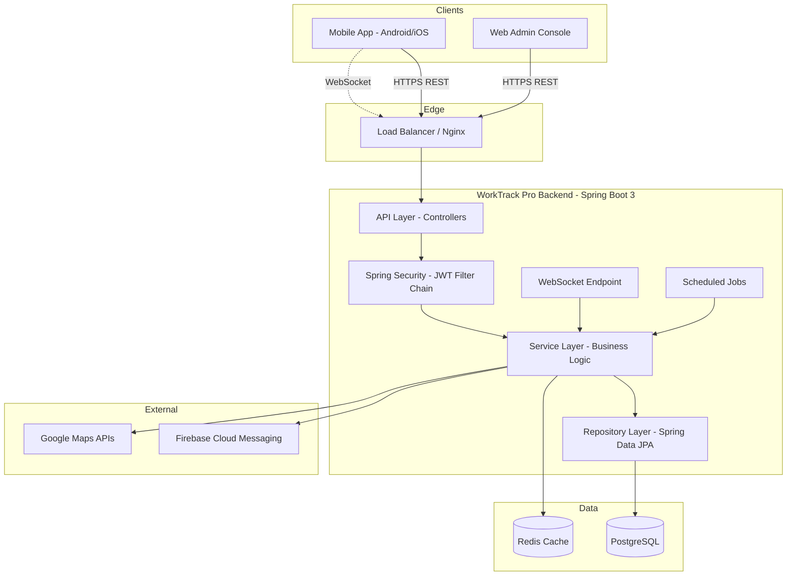

### 8.5 Request Flow

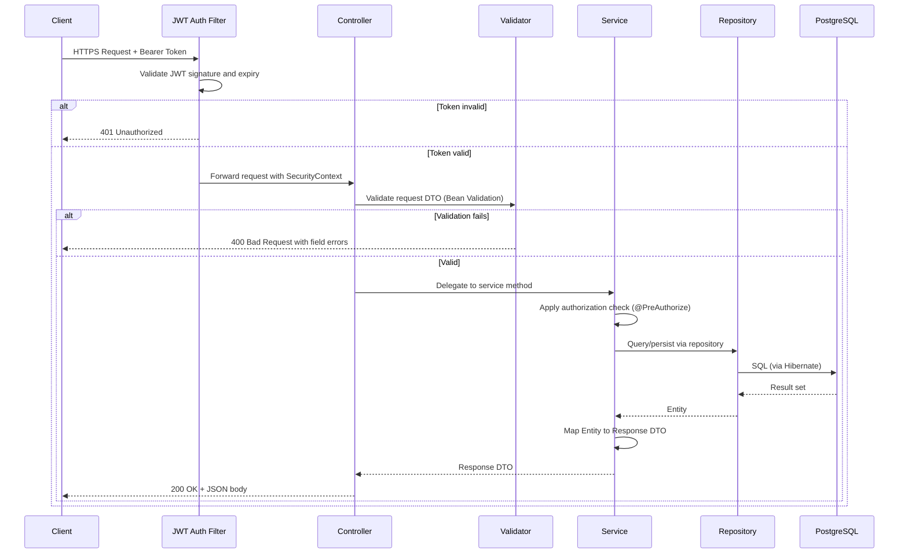

### 8.6 Authentication Flow

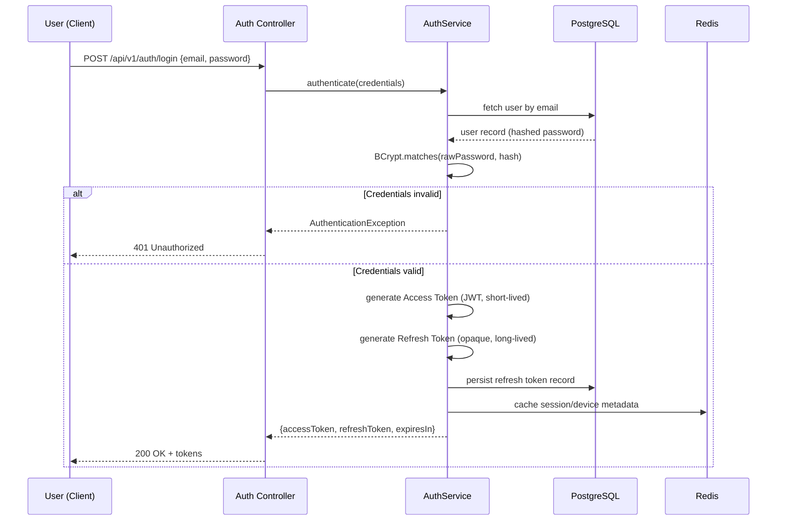

### 8.7 Exception Flow

All exceptions are funneled through a single `@ControllerAdvice` (`GlobalExceptionHandler`), which:

1. Catches domain exceptions (`ResourceNotFoundException`, `BusinessRuleViolationException`, `DuplicateResourceException`, etc.) and maps each to the correct HTTP status.
2. Catches Bean Validation errors (`MethodArgumentNotValidException`) and returns a structured field-level error payload.
3. Catches Spring Security exceptions (`AccessDeniedException`, `AuthenticationException`) and returns `403`/`401` respectively.
4. Catches any unhandled exception as a last resort, logs it with a correlation ID, and returns a generic `500` — **never** leaking stack traces or internal messages to the client.

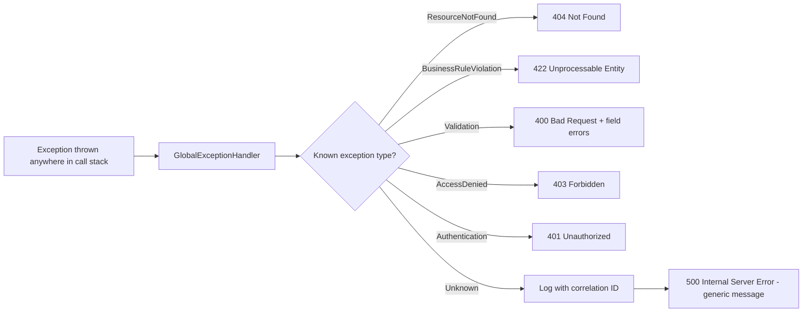

### 8.8 Logging Flow

- **Structured JSON logging** (via Logback + Logstash encoder) so logs are directly queryable in an aggregator (ELK/CloudWatch/Datadog — infra-agnostic by design).
- Every request is tagged with a **correlation ID** (generated at the edge filter, propagated via MDC) so a single user action can be traced across controller → service → repository → external API calls.
- Three log levels used with discipline: `INFO` for business events (leave approved, task assigned), `WARN` for recoverable anomalies (geofence violation attempt), `ERROR` for unhandled failures.
- Sensitive fields (passwords, tokens, GPS precision beyond what's needed) are never logged — enforced via a custom Logback masking pattern.

### 8.9 Notification Flow

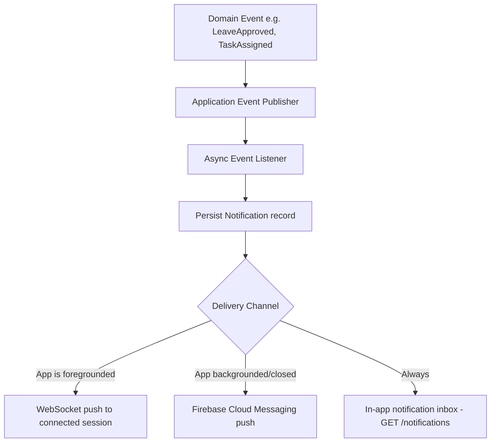

### 8.10 Offline Synchronization Flow

Field employees frequently operate with intermittent connectivity. The mobile app queues actions locally (check-in, task status updates, daily reports) and syncs when connectivity returns.

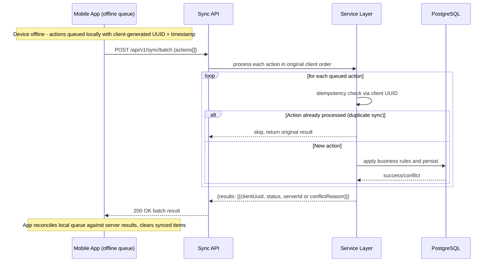

**Conflict handling rule:** server state always wins for attendance (a GPS check-in is a point-in-time fact); for daily reports and task status, last-write-wins by server-received timestamp, with the losing client update surfaced back to the user for review rather than silently discarded.


---

## 9. Backend Folder Structure

```
worktrack-pro-backend/
├── src/
│   ├── main/
│   │   ├── java/
│   │   │   └── com/worktrack/
│   │   │       ├── config/            # Spring configuration classes
│   │   │       ├── controller/        # REST controllers (HTTP layer only)
│   │   │       ├── service/           # Service interfaces (business contracts)
│   │   │       ├── serviceImpl/       # Service implementations
│   │   │       ├── repository/        # Spring Data JPA repositories
│   │   │       ├── entity/            # JPA entities
│   │   │       ├── dto/               # Request/Response DTOs
│   │   │       │   ├── request/
│   │   │       │   └── response/
│   │   │       ├── mapper/            # Entity <-> DTO mappers
│   │   │       ├── security/          # Security configuration, JWT provider
│   │   │       │   ├── jwt/
│   │   │       │   └── filter/
│   │   │       ├── validation/        # Custom Bean Validation annotations
│   │   │       ├── exception/         # Custom exceptions + GlobalExceptionHandler
│   │   │       ├── audit/             # Audit logging aspect + listener
│   │   │       ├── common/            # Shared base classes (BaseEntity, ApiResponse)
│   │   │       ├── constants/         # Enum-like constants, error codes
│   │   │       ├── scheduler/         # Scheduled/cron jobs
│   │   │       ├── notification/      # Notification dispatch (FCM, WebSocket, Email)
│   │   │       ├── websocket/         # STOMP/WebSocket configuration and handlers
│   │   │       ├── interceptor/       # HandlerInterceptors (correlation ID, rate limit)
│   │   │       └── util/              # Stateless utility classes (GeoUtils, DateUtils)
│   │   └── resources/
│   │       ├── application.yml        # Base configuration
│   │       ├── application-dev.yml
│   │       ├── application-staging.yml
│   │       ├── application-prod.yml
│   │       └── db/migration/          # Flyway versioned SQL migrations (V1__, V2__...)
│   └── test/
│       └── java/com/worktrack/        # Mirrors main/java structure 1:1
├── docker/
│   ├── Dockerfile
│   └── docker-compose.yml
├── docs/
│   └── openapi/                       # Exported OpenAPI specs per release
├── build.gradle.kts
└── README.md
```

### 9.1 Folder-by-Folder Responsibility

| Folder | Responsibility | Depends on | Must NOT contain |
|---|---|---|---|
| `config/` | `@Configuration` beans: `SecurityConfig`, `RedisConfig`, `SwaggerConfig`, `WebSocketConfig`, `AsyncConfig`, `CorsConfig` | Spring context only | Business logic |
| `controller/` | Map HTTP verbs/paths to service calls; DTO in, DTO out | `service/`, `dto/` | Repository or Entity access, business rules |
| `service/` | Interfaces declaring business capabilities (`AttendanceService.checkIn(...)`) | `dto/` | Implementation details |
| `serviceImpl/` | Business logic, transaction boundaries (`@Transactional`), orchestration | `repository/`, `mapper/`, `entity/` | HTTP concerns (status codes, headers) |
| `repository/` | `JpaRepository`/`JpaSpecificationExecutor` interfaces | `entity/` | Business logic beyond query composition |
| `entity/` | `@Entity` classes mirroring DB tables exactly | `common/BaseEntity` | DTO annotations, API-facing logic |
| `dto/` | Immutable request/response records with Bean Validation annotations | — | JPA annotations, persistence logic |
| `mapper/` | Pure functions converting Entity ⇄ DTO | `entity/`, `dto/` | Business logic, DB calls |
| `security/` | JWT generation/validation, `UserDetailsService`, filter chain wiring | `entity/` (User), `repository/` | — |
| `validation/` | Custom annotations (`@ValidPhoneNumber`, `@FutureOrToday`) + validators | — | — |
| `exception/` | Domain exceptions + `@ControllerAdvice` global handler | — | — |
| `audit/` | AOP `@Aspect` intercepting mutating service methods, writing to `audit_logs` | `entity/AuditLog`, `repository/` | — |
| `common/` | `BaseEntity` (id, createdAt, updatedAt, createdBy), `ApiResponse<T>` wrapper, `PageResponse<T>` | — | Domain-specific logic |
| `constants/` | Enums (`LeaveStatus`, `TaskPriority`, `AttendanceStatus`), error code registry | — | — |
| `scheduler/` | `@Scheduled` jobs: attendance auto-checkout, leave accrual, notification digest | `service/` | Direct repository access (goes through service) |
| `notification/` | Channel implementations (FCM sender, WebSocket publisher, email sender) behind a common `NotificationChannel` interface | `external clients` | Business decision of *when* to notify (that's in service layer) |
| `websocket/` | STOMP endpoint registration, session registry, message handlers | `notification/` | — |
| `interceptor/` | Cross-cutting HTTP concerns: correlation ID injection, request logging, rate-limit pre-check | — | Business logic |
| `util/` | Stateless helpers: `GeoUtils.distanceMeters(...)`, `DateUtils`, `PasswordPolicy` | — | Spring-managed state |

**Best practices enforced by this structure:**
- A controller may **never** inject a `Repository` directly — it must go through a `Service`.
- Entities are **never** returned from a controller — always mapped to a DTO first, preventing accidental exposure of internal fields or lazy-loading exceptions (`LazyInitializationException`) leaking as 500 errors.
- Every mutating `serviceImpl` method that changes persisted state is annotated so the `audit/` aspect can intercept it — audit logging is never manually called inline, preventing missed audit entries.

---

## 10. Database Design

**Conventions used across every table:**
- Primary key: `id BIGINT GENERATED ALWAYS AS IDENTITY` unless noted.
- Every table includes audit columns via the `BaseEntity` pattern: `created_at TIMESTAMPTZ NOT NULL DEFAULT now()`, `updated_at TIMESTAMPTZ`, `created_by BIGINT`, `updated_by BIGINT`.
- Soft-delete via `is_deleted BOOLEAN NOT NULL DEFAULT false` on all business entities (never hard-delete records with historical significance).
- All foreign keys are indexed by default (Postgres does not auto-index FKs, so this is done explicitly in migrations).
- Multi-tenancy: every table below `companies` carries a direct or transitive `company_id` to enforce tenant isolation at the query level.

### 10.1 `companies`

**Purpose:** Root tenant entity. Every other business record traces back to a company.

| Column | Type | Nullable | Constraints | Notes |
|---|---|---|---|---|
| id | BIGINT | No | PK | |
| name | VARCHAR(150) | No | UNIQUE | |
| registration_number | VARCHAR(50) | Yes | UNIQUE | Legal entity registration |
| industry | VARCHAR(100) | Yes | | |
| subscription_plan | VARCHAR(30) | No | CHECK IN ('TRIAL','BASIC','PRO','ENTERPRISE') | Drives feature flags |
| status | VARCHAR(20) | No | CHECK IN ('ACTIVE','SUSPENDED','TRIAL_EXPIRED') | |
| timezone | VARCHAR(50) | No | DEFAULT 'UTC' | Used for attendance day-boundary calculations |
| created_at / updated_at / created_by / updated_by / is_deleted | — | — | — | BaseEntity |

**Business rules:** A `SUSPENDED` company blocks all write APIs for its employees but still permits read access for data export (compliance requirement).

### 10.2 `branches`

**Purpose:** Physical/operational locations of a company; the geofence anchor for attendance.

| Column | Type | Nullable | Constraints | Notes |
|---|---|---|---|---|
| id | BIGINT | No | PK | |
| company_id | BIGINT | No | FK → companies.id | Indexed |
| name | VARCHAR(150) | No | | |
| address | TEXT | Yes | | |
| latitude | DECIMAL(9,6) | No | | Geofence center |
| longitude | DECIMAL(9,6) | No | | Geofence center |
| geofence_radius_meters | INTEGER | No | DEFAULT 200, CHECK > 0 | |
| status | VARCHAR(20) | No | CHECK IN ('ACTIVE','INACTIVE') | |

**Relationships:** `companies (1) → (N) branches`

### 10.3 `departments`

| Column | Type | Nullable | Constraints | Notes |
|---|---|---|---|---|
| id | BIGINT | No | PK | |
| company_id | BIGINT | No | FK → companies.id | |
| branch_id | BIGINT | Yes | FK → branches.id | Nullable: a department can span branches |
| name | VARCHAR(100) | No | UNIQUE per company | |
| parent_department_id | BIGINT | Yes | FK → departments.id (self) | Supports sub-departments |

### 10.4 `designations`

| Column | Type | Nullable | Constraints | Notes |
|---|---|---|---|---|
| id | BIGINT | No | PK | |
| company_id | BIGINT | No | FK → companies.id | |
| title | VARCHAR(100) | No | | e.g. "Field Sales Executive" |
| level | INTEGER | Yes | | Seniority ranking, used in approval chains |

### 10.5 `roles`

| Column | Type | Nullable | Constraints | Notes |
|---|---|---|---|---|
| id | BIGINT | No | PK | |
| company_id | BIGINT | Yes | FK → companies.id | NULL = system-defined global role (e.g. Super Admin) |
| name | VARCHAR(50) | No | | SUPER_ADMIN, COMPANY_ADMIN, HR_MANAGER, MANAGER, EMPLOYEE |
| is_system_role | BOOLEAN | No | DEFAULT false | System roles cannot be edited/deleted by tenants |

### 10.6 `permissions`

| Column | Type | Nullable | Constraints | Notes |
|---|---|---|---|---|
| id | BIGINT | No | PK | |
| code | VARCHAR(100) | No | UNIQUE | e.g. `LEAVE_APPROVE`, `EMPLOYEE_CREATE` |
| description | VARCHAR(255) | Yes | | |
| module | VARCHAR(50) | No | | Groups permissions for UI display (ATTENDANCE, LEAVE, TASK...) |

### 10.7 `role_permissions` (join table)

| Column | Type | Nullable | Constraints |
|---|---|---|---|
| role_id | BIGINT | No | FK → roles.id, PK part 1 |
| permission_id | BIGINT | No | FK → permissions.id, PK part 2 |

### 10.8 `employees`

**Purpose:** Core identity + HR record for every user of the system (including admins — an admin is an employee with an elevated role).

| Column | Type | Nullable | Constraints | Notes |
|---|---|---|---|---|
| id | BIGINT | No | PK | |
| company_id | BIGINT | No | FK → companies.id | |
| branch_id | BIGINT | No | FK → branches.id | |
| department_id | BIGINT | Yes | FK → departments.id | |
| designation_id | BIGINT | Yes | FK → designations.id | |
| role_id | BIGINT | No | FK → roles.id | |
| manager_id | BIGINT | Yes | FK → employees.id (self) | Direct reporting line, drives approval routing |
| employee_code | VARCHAR(30) | No | UNIQUE per company | Human-readable ID (e.g. "EMP-0042") |
| full_name | VARCHAR(150) | No | | |
| email | VARCHAR(150) | No | UNIQUE | Login identifier |
| phone | VARCHAR(20) | Yes | | |
| password_hash | VARCHAR(255) | No | | BCrypt, never returned in any DTO |
| date_of_joining | DATE | No | | |
| employment_status | VARCHAR(20) | No | CHECK IN ('ACTIVE','ON_LEAVE','SUSPENDED','TERMINATED') | |
| profile_photo_url | VARCHAR(500) | Yes | | |

**Business rules:** `manager_id` must reference an employee in the same `company_id` (enforced in service layer, not DB, since cross-table CHECK constraints aren't portable). Terminated employees are never hard-deleted — `employment_status = 'TERMINATED'` + `is_deleted = true` preserves historical attendance/task records for compliance.

### 10.9 `attendance`

**Purpose:** One row per employee per work-day — the daily summary record.

| Column | Type | Nullable | Constraints | Notes |
|---|---|---|---|---|
| id | BIGINT | No | PK | |
| employee_id | BIGINT | No | FK → employees.id | |
| work_date | DATE | No | | UNIQUE together with employee_id |
| check_in_time | TIMESTAMPTZ | Yes | | |
| check_out_time | TIMESTAMPTZ | Yes | | |
| total_working_minutes | INTEGER | Yes | | Computed on checkout |
| status | VARCHAR(20) | No | CHECK IN ('PRESENT','ABSENT','HALF_DAY','LATE','ON_LEAVE') | |
| is_late | BOOLEAN | No | DEFAULT false | |
| overtime_minutes | INTEGER | No | DEFAULT 0 | |

**Constraints:** `UNIQUE(employee_id, work_date)` — one attendance record per employee per day, guaranteeing idempotent check-in.

### 10.10 `attendance_logs`

**Purpose:** Immutable, append-only raw event log — every individual check-in/out/correction event, including GPS proof. `attendance` is the derived summary; `attendance_logs` is the source of truth.

| Column | Type | Nullable | Constraints | Notes |
|---|---|---|---|---|
| id | BIGINT | No | PK | |
| attendance_id | BIGINT | No | FK → attendance.id | |
| employee_id | BIGINT | No | FK → employees.id | Denormalized for fast querying |
| event_type | VARCHAR(20) | No | CHECK IN ('CHECK_IN','CHECK_OUT','CORRECTION') | |
| event_time | TIMESTAMPTZ | No | | |
| latitude | DECIMAL(9,6) | No | | |
| longitude | DECIMAL(9,6) | No | | |
| distance_from_branch_meters | DECIMAL(8,2) | No | | Computed at event time |
| within_geofence | BOOLEAN | No | | |
| device_id | VARCHAR(100) | Yes | | Fraud-detection signal |
| photo_url | VARCHAR(500) | Yes | | Optional selfie verification |

**Immutability rule:** rows in this table are **never updated or deleted** by application code — corrections are new rows with `event_type = 'CORRECTION'` plus a linked `correction_reason` and approver, preserving a full forensic trail.

### 10.11 `leave_types`

| Column | Type | Nullable | Constraints | Notes |
|---|---|---|---|---|
| id | BIGINT | No | PK | |
| company_id | BIGINT | No | FK → companies.id | |
| name | VARCHAR(50) | No | | Sick, Casual, Earned, Unpaid... |
| max_days_per_year | INTEGER | Yes | | NULL = unlimited (e.g. unpaid) |
| carry_forward_allowed | BOOLEAN | No | DEFAULT false | |
| requires_approval | BOOLEAN | No | DEFAULT true | |

### 10.12 `leave_requests`

| Column | Type | Nullable | Constraints | Notes |
|---|---|---|---|---|
| id | BIGINT | No | PK | |
| employee_id | BIGINT | No | FK → employees.id | |
| leave_type_id | BIGINT | No | FK → leave_types.id | |
| start_date | DATE | No | | |
| end_date | DATE | No | | CHECK end_date >= start_date |
| total_days | DECIMAL(4,1) | No | | Supports half-day leave (0.5) |
| reason | TEXT | Yes | | |
| status | VARCHAR(20) | No | CHECK IN ('PENDING','APPROVED','REJECTED','CANCELLED') | |
| approved_by | BIGINT | Yes | FK → employees.id | |
| approved_at | TIMESTAMPTZ | Yes | | |
| rejection_reason | TEXT | Yes | | |

**Business rules:** A request cannot be created if it overlaps an existing `PENDING` or `APPROVED` request for the same employee (checked in service layer via a date-range overlap query). Approving a request that would exceed the employee's remaining `leave_balances` entry is rejected with a `422`.

### 10.13 `leave_balances`

| Column | Type | Nullable | Constraints |
|---|---|---|---|
| id | BIGINT | No | PK |
| employee_id | BIGINT | No | FK → employees.id |
| leave_type_id | BIGINT | No | FK → leave_types.id |
| year | INTEGER | No | |
| allocated_days | DECIMAL(4,1) | No | |
| used_days | DECIMAL(4,1) | No | DEFAULT 0 |

`UNIQUE(employee_id, leave_type_id, year)`

### 10.14 `holidays`

| Column | Type | Nullable | Notes |
|---|---|---|---|
| id | BIGINT | No | |
| company_id | BIGINT | No | FK → companies.id |
| name | VARCHAR(100) | No | |
| holiday_date | DATE | No | |
| is_optional | BOOLEAN | No | DEFAULT false |

### 10.15 `tasks`

| Column | Type | Nullable | Constraints | Notes |
|---|---|---|---|---|
| id | BIGINT | No | PK | |
| company_id | BIGINT | No | FK → companies.id | |
| title | VARCHAR(200) | No | | |
| description | TEXT | Yes | | |
| priority | VARCHAR(10) | No | CHECK IN ('LOW','MEDIUM','HIGH','URGENT') | |
| status | VARCHAR(20) | No | CHECK IN ('OPEN','IN_PROGRESS','COMPLETED','CANCELLED') | |
| due_date | DATE | Yes | | |
| created_by | BIGINT | No | FK → employees.id | |
| progress_percent | SMALLINT | No | DEFAULT 0, CHECK BETWEEN 0 AND 100 | |

### 10.16 `task_assignments`

**Purpose:** Many-to-many — a task may be assigned to multiple employees, and per-assignee status tracked independently.

| Column | Type | Nullable | Constraints |
|---|---|---|---|
| id | BIGINT | No | PK |
| task_id | BIGINT | No | FK → tasks.id |
| employee_id | BIGINT | No | FK → employees.id |
| individual_status | VARCHAR(20) | No | CHECK IN ('ASSIGNED','ACCEPTED','IN_PROGRESS','COMPLETED') |
| assigned_at | TIMESTAMPTZ | No | |
| completed_at | TIMESTAMPTZ | Yes | |

`UNIQUE(task_id, employee_id)`

### 10.17 `daily_reports`

| Column | Type | Nullable | Constraints | Notes |
|---|---|---|---|---|
| id | BIGINT | No | PK | |
| employee_id | BIGINT | No | FK → employees.id | |
| report_date | DATE | No | | |
| summary | TEXT | No | | |
| tasks_completed | INTEGER | No | DEFAULT 0 | |
| hours_worked | DECIMAL(4,1) | Yes | | |
| submitted_at | TIMESTAMPTZ | No | | |

`UNIQUE(employee_id, report_date)`

### 10.18 `notifications`

| Column | Type | Nullable | Constraints | Notes |
|---|---|---|---|---|
| id | BIGINT | No | PK | |
| recipient_employee_id | BIGINT | No | FK → employees.id | |
| title | VARCHAR(200) | No | | |
| body | TEXT | No | | |
| type | VARCHAR(30) | No | | LEAVE_APPROVED, TASK_ASSIGNED, ANNOUNCEMENT... |
| is_read | BOOLEAN | No | DEFAULT false | |
| reference_id | BIGINT | Yes | | Polymorphic pointer to source entity (leave_request.id, task.id, etc.) |
| reference_type | VARCHAR(30) | Yes | | Discriminator for reference_id |

### 10.19 `announcements`

| Column | Type | Nullable | Notes |
|---|---|---|---|
| id | BIGINT | No | |
| company_id | BIGINT | No | FK → companies.id |
| title | VARCHAR(200) | No | |
| body | TEXT | No | |
| target_scope | VARCHAR(20) | No | COMPANY, BRANCH, DEPARTMENT |
| target_id | BIGINT | Yes | Nullable when scope = COMPANY |
| published_by | BIGINT | No | FK → employees.id |
| published_at | TIMESTAMPTZ | No | |

### 10.20 `refresh_tokens`

| Column | Type | Nullable | Constraints | Notes |
|---|---|---|---|---|
| id | BIGINT | No | PK | |
| employee_id | BIGINT | No | FK → employees.id | |
| token_hash | VARCHAR(255) | No | UNIQUE | Only the hash is stored, never the raw token |
| device_id | VARCHAR(100) | Yes | | |
| issued_at | TIMESTAMPTZ | No | | |
| expires_at | TIMESTAMPTZ | No | | |
| revoked | BOOLEAN | No | DEFAULT false | Set true on logout / rotation |

### 10.21 `device_tokens`

**Purpose:** FCM registration tokens for push delivery, one employee may have multiple devices.

| Column | Type | Nullable | Constraints |
|---|---|---|---|
| id | BIGINT | No | PK |
| employee_id | BIGINT | No | FK → employees.id |
| fcm_token | VARCHAR(500) | No | UNIQUE |
| platform | VARCHAR(10) | No | CHECK IN ('ANDROID','IOS','WEB') |
| last_active_at | TIMESTAMPTZ | No | |

### 10.22 `audit_logs`

**Purpose:** Immutable record of every mutating action across the system, for compliance and forensic review.

| Column | Type | Nullable | Notes |
|---|---|---|---|
| id | BIGINT | No | |
| company_id | BIGINT | Yes | Denormalized for tenant-scoped queries |
| actor_employee_id | BIGINT | Yes | Who performed the action (NULL for system/scheduler actions) |
| action | VARCHAR(50) | No | e.g. `LEAVE_APPROVED`, `EMPLOYEE_UPDATED` |
| entity_type | VARCHAR(50) | No | e.g. `LeaveRequest` |
| entity_id | BIGINT | No | |
| before_state | JSONB | Yes | Snapshot prior to change |
| after_state | JSONB | Yes | Snapshot after change |
| ip_address | VARCHAR(45) | Yes | |
| performed_at | TIMESTAMPTZ | No | |

This table has **no update/delete permissions** granted at the database role level — application and DBA accounts alike can only `INSERT`/`SELECT`, enforced via Postgres `GRANT` statements, not just application code discipline.

### 10.23 `system_settings`

| Column | Type | Nullable | Notes |
|---|---|---|---|
| id | BIGINT | No | |
| company_id | BIGINT | Yes | NULL = platform-level default |
| setting_key | VARCHAR(100) | No | e.g. `LATE_ARRIVAL_GRACE_MINUTES` |
| setting_value | VARCHAR(500) | No | |

`UNIQUE(company_id, setting_key)` — company-specific override falls back to platform default when absent.

### 10.24 Indexing Strategy Summary

| Table | Index | Reason |
|---|---|---|
| attendance | `(employee_id, work_date)` unique | Idempotent daily check-in, fast "today's record" lookup |
| attendance_logs | `(employee_id, event_time)` | Chronological history queries |
| leave_requests | `(employee_id, status)` | "My pending leaves" and approver queues |
| tasks | `(company_id, status, due_date)` | Dashboard "overdue tasks" queries |
| notifications | `(recipient_employee_id, is_read)` | Unread-count badge, most frequent query in the system |
| audit_logs | `(company_id, entity_type, entity_id)` | "History of this record" lookups |


---

## 11. Entity Relationships

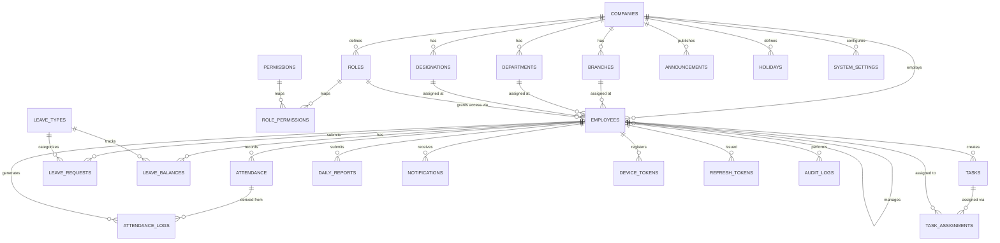

---

## 12. API Documentation

**Base URL:** `https://api.worktrackpro.com/api/v1`
**Format:** JSON over HTTPS. All responses wrapped in a standard envelope:

```json
{
  "success": true,
  "data": { },
  "message": "string",
  "timestamp": "2026-07-27T10:00:00Z"
}
```

Paginated list responses use:

```json
{
  "success": true,
  "data": {
    "content": [ ],
    "page": 0,
    "size": 20,
    "totalElements": 134,
    "totalPages": 7
  }
}
```

**Standard error envelope:**

```json
{
  "success": false,
  "errorCode": "LEAVE_BALANCE_EXCEEDED",
  "message": "Requested leave exceeds available balance",
  "fieldErrors": [],
  "timestamp": "2026-07-27T10:00:00Z"
}
```

**Authorization header (all endpoints except `/auth/**`):** `Authorization: Bearer <accessToken>`

---

### 12.1 Authentication APIs

| Endpoint | Method | Purpose | Auth |
|---|---|---|---|
| `/auth/login` | POST | Authenticate with email + password, issue token pair | Public |
| `/auth/refresh` | POST | Exchange a valid refresh token for a new access token | Public (valid refresh token required) |
| `/auth/logout` | POST | Revoke the current refresh token | Bearer |
| `/auth/forgot-password` | POST | Trigger OTP-based password reset email | Public |
| `/auth/reset-password` | POST | Complete password reset using OTP | Public |
| `/auth/otp/verify` | POST | Verify an OTP code | Public |

**POST `/auth/login`**
- **Purpose:** Primary login for all roles.
- **Headers:** `Content-Type: application/json`
- **Request:**
```json
{ "email": "jane.doe@company.com", "password": "••••••••", "deviceId": "android-uuid-1234" }
```
- **Response `200`:**
```json
{ "accessToken": "eyJ...", "refreshToken": "9f3a...", "expiresIn": 900, "role": "MANAGER" }
```
- **Validation:** `email` must be valid format; `password` min 8 chars.
- **Errors:** `401 INVALID_CREDENTIALS`, `403 ACCOUNT_SUSPENDED`, `429 TOO_MANY_ATTEMPTS`

---

### 12.2 Company APIs

| Endpoint | Method | Purpose | Auth Role |
|---|---|---|---|
| `/companies` | POST | Register a new tenant company | SUPER_ADMIN |
| `/companies/{id}` | GET | Fetch company details | SUPER_ADMIN, COMPANY_ADMIN (self) |
| `/companies/{id}` | PUT | Update company profile/settings | COMPANY_ADMIN |
| `/companies/{id}/status` | PATCH | Suspend/activate a company | SUPER_ADMIN |

### 12.3 Branch / Department / Designation APIs

| Endpoint | Method | Purpose | Auth Role |
|---|---|---|---|
| `/branches` | POST | Create branch (sets geofence lat/lng/radius) | COMPANY_ADMIN |
| `/branches` | GET | List branches (paginated, filterable) | COMPANY_ADMIN, HR_MANAGER |
| `/branches/{id}` | PUT | Update branch (incl. geofence radius) | COMPANY_ADMIN |
| `/departments` | POST | Create department, optional `parentDepartmentId` | COMPANY_ADMIN |
| `/departments` | GET | List departments | COMPANY_ADMIN, HR_MANAGER, MANAGER |
| `/designations` | POST | Create designation | COMPANY_ADMIN |
| `/designations` | GET | List designations | COMPANY_ADMIN, HR_MANAGER |

### 12.4 Employee APIs

| Endpoint | Method | Purpose | Auth Role |
|---|---|---|---|
| `/employees` | POST | Onboard a new employee | COMPANY_ADMIN, HR_MANAGER |
| `/employees` | GET | List/search employees (filters: branch, department, status) | COMPANY_ADMIN, HR_MANAGER, MANAGER (own team) |
| `/employees/{id}` | GET | Get employee profile | Self, Manager, HR_MANAGER, COMPANY_ADMIN |
| `/employees/{id}` | PUT | Update employee profile | HR_MANAGER, COMPANY_ADMIN |
| `/employees/{id}/status` | PATCH | Change employment status (suspend/terminate) | HR_MANAGER, COMPANY_ADMIN |
| `/employees/me` | GET | Get current logged-in user's profile | All authenticated |
| `/employees/me` | PATCH | Update own profile (limited fields: phone, photo) | All authenticated |

**POST `/employees`**
- **Purpose:** Create an employee record and provision login credentials.
- **Request:**
```json
{
  "fullName": "Jane Doe",
  "email": "jane.doe@company.com",
  "phone": "+919876543210",
  "branchId": 4,
  "departmentId": 12,
  "designationId": 7,
  "roleId": 5,
  "managerId": 21,
  "dateOfJoining": "2026-08-01"
}
```
- **Response `201`:** Employee object with system-generated `employeeCode`, temporary password sent via email (never returned in response body).
- **Validation:** `email` unique per system; `branchId`/`departmentId`/`designationId`/`roleId` must belong to the same `companyId` as the requester.
- **Errors:** `409 EMPLOYEE_EMAIL_EXISTS`, `400 INVALID_HIERARCHY_REFERENCE`

### 12.5 Attendance APIs

| Endpoint | Method | Purpose | Auth Role |
|---|---|---|---|
| `/attendance/check-in` | POST | Record check-in with GPS coordinates | Employee (self) |
| `/attendance/check-out` | POST | Record check-out with GPS coordinates | Employee (self) |
| `/attendance/today` | GET | Get current user's today status | Employee (self) |
| `/attendance/history` | GET | Paginated attendance history (date range filter) | Self, Manager (team), HR |
| `/attendance/{id}/correction` | POST | Request a correction to a past record | Employee, approved by Manager/HR |
| `/attendance/team` | GET | Team attendance for a given date | Manager, HR, COMPANY_ADMIN |

**POST `/attendance/check-in`**
- **Purpose:** Validates GPS position against the employee's assigned branch geofence and records a check-in event.
- **Request:**
```json
{ "latitude": 12.971599, "longitude": 77.594566, "deviceId": "android-uuid-1234", "photoUrl": null }
```
- **Response `200`:**
```json
{ "attendanceId": 5521, "status": "PRESENT", "checkInTime": "2026-07-27T09:12:33Z", "isLate": false, "withinGeofence": true }
```
- **Validation:** lat/lng required and within valid ranges; one check-in per employee per day (enforced by `UNIQUE(employee_id, work_date)`).
- **Errors:** `422 OUTSIDE_GEOFENCE`, `409 ALREADY_CHECKED_IN`

### 12.6 Leave APIs

| Endpoint | Method | Purpose | Auth Role |
|---|---|---|---|
| `/leave-types` | GET | List configured leave types | All authenticated |
| `/leave-requests` | POST | Apply for leave | Employee (self) |
| `/leave-requests` | GET | List leave requests (self, or team if Manager/HR) | All authenticated (scoped) |
| `/leave-requests/{id}/approve` | POST | Approve a pending leave request | Manager, HR_MANAGER, COMPANY_ADMIN |
| `/leave-requests/{id}/reject` | POST | Reject a pending leave request with reason | Manager, HR_MANAGER, COMPANY_ADMIN |
| `/leave-requests/{id}/cancel` | POST | Cancel own pending/future-approved request | Employee (self) |
| `/leave-balances/me` | GET | Current user's leave balance by type | Employee (self) |

### 12.7 Task APIs

| Endpoint | Method | Purpose | Auth Role |
|---|---|---|---|
| `/tasks` | POST | Create a task and assign to one or more employees | Manager, HR_MANAGER, COMPANY_ADMIN |
| `/tasks` | GET | List tasks (filters: status, priority, assignee, due date) | All authenticated (scoped) |
| `/tasks/{id}` | GET | Task detail incl. assignment statuses and comments | All authenticated (scoped) |
| `/tasks/{id}/status` | PATCH | Update overall task status | Assignee, Manager |
| `/tasks/{id}/assignments/{employeeId}/status` | PATCH | Update individual assignee progress | Assignee (self) |
| `/tasks/{id}/comments` | POST | Add a comment | Assignee, task creator |

### 12.8 Notification APIs

| Endpoint | Method | Purpose | Auth Role |
|---|---|---|---|
| `/notifications` | GET | Paginated notification inbox for current user | All authenticated |
| `/notifications/unread-count` | GET | Badge count | All authenticated |
| `/notifications/{id}/read` | PATCH | Mark a single notification read | All authenticated (self) |
| `/notifications/read-all` | PATCH | Mark all as read | All authenticated (self) |
| `/announcements` | POST | Publish a company/branch/department announcement | Manager, HR_MANAGER, COMPANY_ADMIN |
| `/announcements` | GET | List announcements visible to current user | All authenticated |
| `/device-tokens` | POST | Register an FCM token for push delivery | All authenticated |

### 12.9 Dashboard & Analytics APIs

| Endpoint | Method | Purpose | Auth Role |
|---|---|---|---|
| `/dashboard/summary` | GET | Role-aware summary cards (today's attendance %, pending approvals, open tasks) | All authenticated |
| `/analytics/attendance-trend` | GET | Attendance % over a date range, grouped by day/week/month | Manager, HR, COMPANY_ADMIN |
| `/analytics/task-completion` | GET | Task completion rate by department/employee | Manager, HR, COMPANY_ADMIN |
| `/analytics/leave-utilization` | GET | Leave usage vs. allocation by department | HR_MANAGER, COMPANY_ADMIN |

### 12.10 Settings & Audit APIs

| Endpoint | Method | Purpose | Auth Role |
|---|---|---|---|
| `/settings` | GET | Fetch effective settings (company override merged with platform default) | COMPANY_ADMIN, HR_MANAGER |
| `/settings/{key}` | PUT | Update a company-level setting | COMPANY_ADMIN |
| `/audit-logs` | GET | Paginated, filterable audit trail | COMPANY_ADMIN (own company), SUPER_ADMIN (all) |
| `/audit-logs/{entityType}/{entityId}` | GET | Full change history of a specific record | COMPANY_ADMIN, SUPER_ADMIN |

### 12.11 Offline Sync API

| Endpoint | Method | Purpose | Auth Role |
|---|---|---|---|
| `/sync/batch` | POST | Submit a batch of queued offline actions with client UUIDs for idempotent replay | Employee (self) |
| `/sync/status` | GET | Server's last-known state hash for delta comparison | Employee (self) |

### 12.12 Common HTTP Status Codes Used Across All APIs

| Code | Meaning | When used |
|---|---|---|
| 200 | OK | Successful GET/PUT/PATCH/POST that doesn't create a resource |
| 201 | Created | Successful resource creation |
| 400 | Bad Request | Malformed request / Bean Validation failure |
| 401 | Unauthorized | Missing/invalid/expired JWT |
| 403 | Forbidden | Valid JWT but insufficient role/permission |
| 404 | Not Found | Resource doesn't exist or is outside requester's tenant scope |
| 409 | Conflict | Duplicate resource / already-processed action |
| 422 | Unprocessable Entity | Business rule violation (e.g., outside geofence, leave balance exceeded) |
| 429 | Too Many Requests | Rate limit exceeded |
| 500 | Internal Server Error | Unhandled exception |


---

## 13. Authentication

### 13.1 Token Model

| Token | Lifetime | Storage | Purpose |
|---|---|---|---|
| **Access Token (JWT)** | 15 minutes | Client memory / secure storage, sent as Bearer header | Authorizes every API call; self-contained (employeeId, companyId, role, permissions claim) so services can authorize without a DB round-trip |
| **Refresh Token** | 30 days (mobile) / 8 hours (web) | Stored server-side as a hash in `refresh_tokens`; raw value held client-side in secure storage | Used solely to obtain a new access token |

### 13.2 Password Handling

- Passwords are hashed with **BCrypt** (work factor 12) — never stored or logged in plaintext.
- Password policy enforced server-side: minimum 8 characters, at least one number and one letter (configurable per company via `system_settings`).
- Password reset always goes through OTP verification — no "security question" fallback (a well-known weak pattern).

### 13.3 Login Flow

1. Client submits email + password to `/auth/login`.
2. Server verifies credentials, checks `employment_status = 'ACTIVE'` and `company.status = 'ACTIVE'`.
3. On success: issues access token (JWT) + refresh token (opaque random string, hashed before storage).
4. Failed attempts are rate-limited per email+IP combination via Redis counters (see [Security](#20-security)).

### 13.4 Logout Flow

- Client calls `/auth/logout` with the refresh token.
- Server marks the corresponding `refresh_tokens` row `revoked = true`.
- Access tokens are **not** individually revocable (JWTs are stateless by design) — they simply expire within 15 minutes, bounding the exposure window of a compromised token.

### 13.5 Token Rotation

- Every call to `/auth/refresh` **rotates** the refresh token: the old one is revoked and a new one issued. This limits the blast radius of a stolen refresh token — reuse of a revoked token triggers automatic revocation of the entire token family and forces re-login (refresh token reuse detection).

### 13.6 Forgot Password / OTP Flow

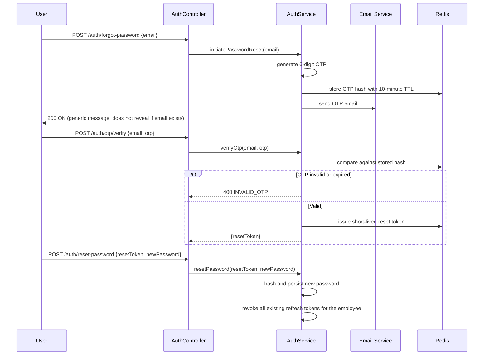

**Security note:** the forgot-password endpoint always returns a generic `200 OK` regardless of whether the email exists, preventing user-enumeration attacks.

### 13.7 Session Management

Since access tokens are stateless, "session management" in WorkTrack Pro means **refresh token management**: an employee can hold multiple active refresh tokens (one per device). The `/employees/me/sessions` concept (device list with last-active time) allows a user or admin to revoke a specific device's session remotely — critical for a lost/stolen field device.

---

## 14. Employee Module

### 14.1 Lifecycle

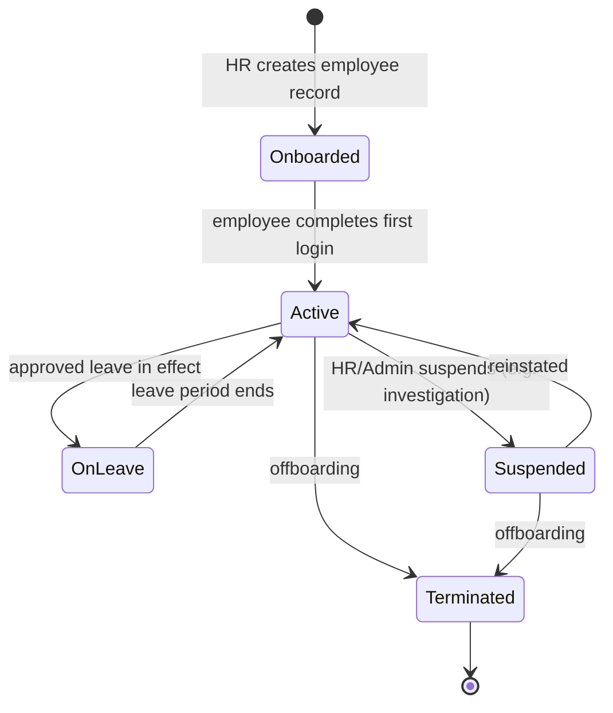

### 14.2 Business Rules

- An employee's `role_id` determines their permission set; role changes are themselves audit-logged (a common privilege-escalation attack vector must be traceable).
- `manager_id` defines the approval chain for leave and the visibility scope for "team" queries (attendance, tasks, reports) — a Manager can only see employees where `manager_id` (directly or transitively, up to a configurable depth) points to them.
- Terminated employees immediately lose API access (their refresh tokens are bulk-revoked and access token validation additionally checks `employment_status` on each request, not just JWT validity, closing the up-to-15-minute stale-token gap).
- Profile updates to sensitive fields (`role_id`, `branch_id`, `company_id`) are restricted to HR_MANAGER/COMPANY_ADMIN — an employee can never self-promote via the `/employees/me` endpoint (enforced by a restricted-field DTO, not just an authorization check, since a permissive DTO would be a defense-in-depth gap).

---

## 15. Attendance Module

### 15.1 GPS & Geofence Validation

Every check-in/check-out submits `latitude`/`longitude`. The server computes the great-circle distance to the employee's assigned branch using the **Haversine formula**, and compares it against `branches.geofence_radius_meters`.

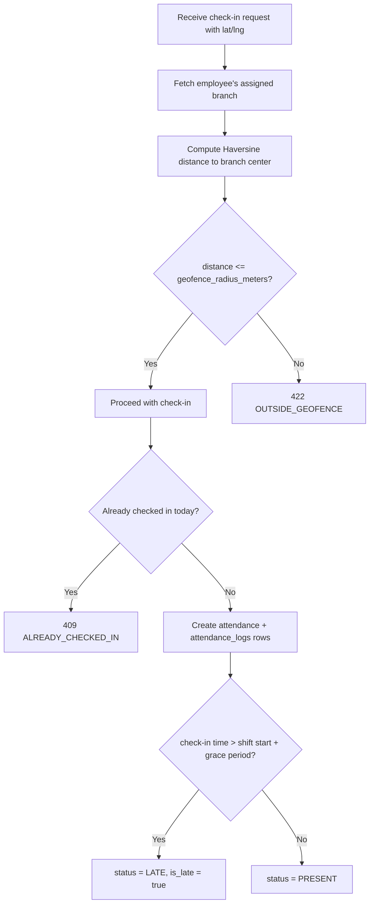

### 15.2 Check-in / Check-out Flow

- **Check-in:** creates the `attendance` row for `work_date = today` (idempotent via unique constraint) and an `attendance_logs` row with `event_type = CHECK_IN`.
- **Check-out:** locates today's `attendance` row, computes `total_working_minutes = check_out_time - check_in_time`, determines `overtime_minutes` if beyond standard shift length, and writes a corresponding `CHECK_OUT` log row.
- If an employee forgets to check out, a scheduled job (see [Deployment §22](#22-deployment)) auto-closes the day at midnight company-local-time with `status = HALF_DAY` (configurable) and flags it for Manager review.

### 15.3 Attendance Correction

An employee (or their manager on their behalf) can submit a correction request referencing a past `attendance` record. This creates a new `attendance_logs` row (`event_type = CORRECTION`) with a mandatory `reason`, and requires Manager/HR approval before the summary `attendance` row is updated — corrections never silently overwrite history.

### 15.4 Late Arrival & Overtime

- **Late arrival threshold:** configurable per company via `system_settings.LATE_ARRIVAL_GRACE_MINUTES` (default 15 minutes past scheduled shift start).
- **Overtime:** any working time beyond `system_settings.STANDARD_SHIFT_MINUTES` (default 480 = 8 hours) is recorded as `overtime_minutes` and surfaced in payroll-adjacent reports (payroll integration itself is out of scope for the current backend, tracked in [Future Enhancements](#26-future-enhancements)).

### 15.5 Attendance Reports

The `/attendance/history` and `/attendance/team` endpoints support filtering by date range, status, and department, and are backed by indexed queries (see [§10.24](#1024-indexing-strategy-summary)) to remain performant at scale.

---

## 16. Leave Module

### 16.1 Leave Request State Machine

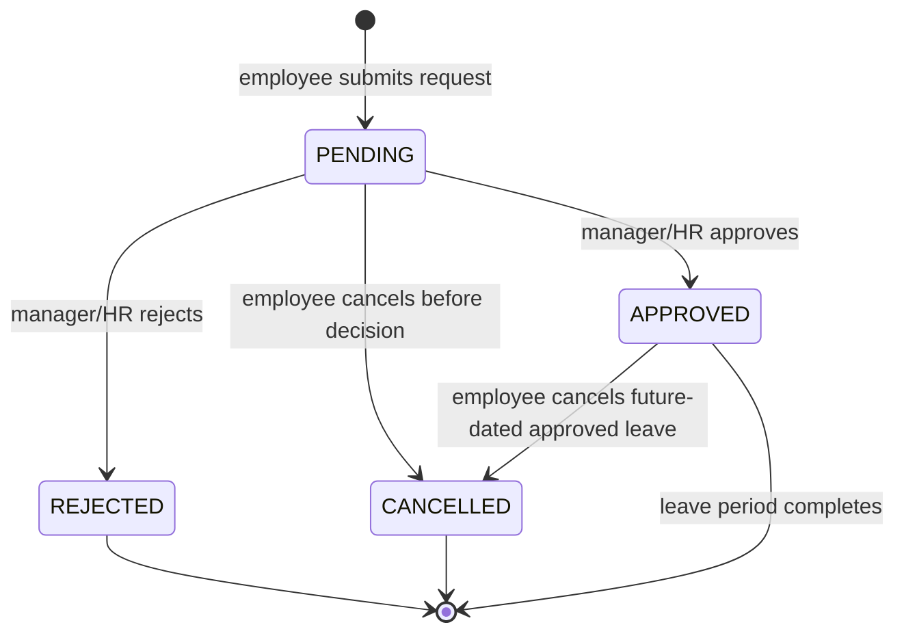

### 16.2 Apply → Approve → Reject Workflow

1. Employee submits a request with `leaveTypeId`, `startDate`, `endDate`, `reason`.
2. Server validates: no overlapping `PENDING`/`APPROVED` request; sufficient `leave_balances.allocated_days - used_days`; date range does not include already-attended past dates.
3. Request routes to the employee's `manager_id` (or HR if no manager assigned) as a pending approval.
4. On **approval**: `leave_balances.used_days` is incremented atomically within the same transaction as the status update (preventing race conditions from concurrent approvals); a `LeaveApprovedEvent` triggers notification dispatch; corresponding `attendance` rows for the leave date range are pre-created with `status = ON_LEAVE`.
5. On **rejection**: `rejection_reason` is mandatory; no balance is deducted.

### 16.3 Leave Balance & Calendar

- Balances are seeded annually by a scheduled job based on `leave_types.max_days_per_year`, respecting `carry_forward_allowed` (unused prior-year days added, capped at a configurable maximum).
- `/leave-requests` supports a calendar view (grouped by date) so Managers can see team availability at a glance before approving new requests.

### 16.4 Validation Rules

| Rule | Enforcement point |
|---|---|
| No overlapping requests | Service layer, date-range overlap query |
| Sufficient balance | Service layer, checked inside the approval transaction (not just at submission, since balance can change between submission and approval) |
| Cannot apply for past dates (except HR-initiated backdated sick leave) | Bean Validation + service rule |
| Half-day leave only for leave types with `allows_half_day` | Service layer |
| Cancellation only allowed while `PENDING` or while `APPROVED` and start_date is in the future | Service layer state check |

---

## 17. Task Module

### 17.1 Core Concepts

- A **Task** is the unit of work; **Task Assignment** is the join between a task and each assigned employee, allowing multi-assignee tasks with independently tracked progress.
- **Priority** (`LOW`/`MEDIUM`/`HIGH`/`URGENT`) drives default sort order in list views and notification urgency.
- **Status** on the parent `Task` is derived: `COMPLETED` only when *all* assignments reach `COMPLETED`; otherwise `IN_PROGRESS` if any assignment has started.

### 17.2 Task Lifecycle

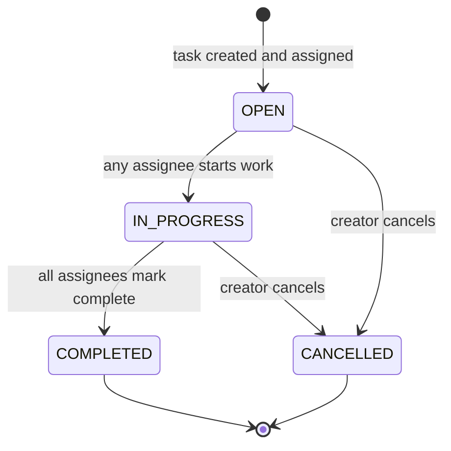

### 17.3 Comments & Attachments

- Comments are threaded under a task (`task_id` FK), visible to all assignees and the creator, timestamped and attributed — forming a lightweight audit trail of task discussion without needing a separate chat system.
- Attachments are stored as object-storage references (URL + metadata) rather than binary blobs in Postgres, keeping the database lean; upload validation (file type/size) happens at the API layer before a presigned URL is issued (see [Security §20.12](#20-security)).

### 17.4 Progress & Completion Reporting

`task_assignments.individual_status` feeds directly into the Analytics module's task-completion-rate calculation, and into an employee's Daily Report as a suggested "tasks completed today" prefill.

---

## 18. Notifications

### 18.1 Channels

| Channel | Delivery guarantee | Used for |
|---|---|---|
| **WebSocket (STOMP)** | Only while client actively connected | Instant in-app banners while the app is open |
| **Firebase Cloud Messaging** | Delivered even if app backgrounded/killed (subject to OS constraints) | Leave decisions, task assignments, announcements |
| **In-app inbox** (`/notifications`) | Always — persisted regardless of delivery success on the above | Source of truth; a user can always catch up by opening the inbox |

### 18.2 Why Two Real-Time Channels?

WebSocket alone is insufficient for a field-workforce mobile app: connections drop frequently (poor cellular coverage), and mobile OSes aggressively suspend background socket connections to save battery. FCM is the OS-level-integrated mechanism guaranteed to wake the app for a notification. WebSocket is retained for the **web admin console**, where persistent connections are cheap and instant updates (e.g., a live "pending approvals" counter) meaningfully improve the admin experience.

### 18.3 Notification Preferences

Employees can opt out of non-critical categories (e.g., `ANNOUNCEMENT`) per channel via a preferences record, but cannot opt out of role-critical categories (`LEAVE_DECISION`, `TASK_ASSIGNED`) — these are always delivered to the in-app inbox at minimum.

### 18.4 Notification History

All notifications persist in `notifications` regardless of read state, giving both the employee and (for compliance) an admin a complete communication record — critical for disputes like "I was never told about this task."

---

## 19. Analytics

### 19.1 Dashboard Composition

`/dashboard/summary` is role-aware: the same endpoint returns different card sets depending on the caller's role, computed server-side rather than the client filtering a superset (preventing accidental data exposure to lower-privilege roles).

| Role | Dashboard cards shown |
|---|---|
| Employee | Today's attendance status, pending leave requests, assigned open tasks |
| Manager | Team attendance %, pending approvals count, team task completion rate |
| HR_MANAGER | Company-wide attendance %, leave utilization, employee headcount by status |
| COMPANY_ADMIN | All of the above + branch/department comparison views |

### 19.2 Computation Strategy

- Real-time cards (today's attendance %) are computed on-demand from `attendance`, cached in Redis with a short TTL (60 seconds) to absorb dashboard-refresh traffic spikes.
- Historical trend endpoints (`/analytics/attendance-trend`, etc.) are computed from indexed aggregate queries; for companies exceeding a configurable employee-count threshold, these are pre-aggregated nightly into summary tables (materialized view or dedicated `*_daily_summary` tables) rather than computed live, to bound query cost as data grows — this is a documented scaling lever, not implemented until the threshold is actually reached (see [Future Enhancements](#26-future-enhancements)).


---

## 20. Security

| Concern | Mechanism |
|---|---|
| **Authentication** | JWT access + rotating refresh tokens (see [§13](#13-authentication)) |
| **Authorization (RBAC)** | Spring Security `@PreAuthorize("hasAuthority('LEAVE_APPROVE')")` at the service-method level — checked server-side regardless of what the client UI shows/hides |
| **Password Encryption** | BCrypt, work factor 12; never logged, never returned in any DTO (enforced by DTOs that structurally omit the field, not just serialization annotations) |
| **Rate Limiting** | Redis-backed sliding-window counters on `/auth/login` (5/min/IP+email), `/attendance/check-in` (prevents check-in spam), and globally per-IP as a DDoS backstop |
| **Input Validation** | Bean Validation (`jakarta.validation`) on every request DTO; custom validators for domain rules (`@ValidGeoCoordinate`, `@ValidDateRange`) |
| **SQL Injection Protection** | Exclusively parameterized queries via JPA/Hibernate; any native SQL (reporting queries) uses named parameters, never string concatenation |
| **XSS Prevention** | All user-supplied text fields (task descriptions, comments, announcements) are stored as-is but HTML-escaped at render time by the client; API additionally strips executable script tags server-side as defense-in-depth |
| **CORS** | Explicit allow-list of known frontend origins (web admin domain, mobile app doesn't use CORS); no wildcard `*` origins in any environment including dev |
| **HTTPS** | Enforced at the load balancer/Nginx layer; HTTP requests redirected, HSTS header set |
| **Audit Logs** | Every mutating action intercepted by an AOP aspect and written to the append-only `audit_logs` table (see [§10.22](#1022-audit_logs)) |
| **Secure File Upload** | Uploads validated for MIME type and size *before* a presigned upload URL is issued; files are never proxied through the application server; virus scanning hook reserved for future integration |
| **Secrets Management** | Database credentials, JWT signing keys, FCM service account, and Google Maps API key are injected via environment variables / a secrets manager — never committed to source control |
| **Multi-tenant Isolation** | Every repository query is scoped by `company_id` derived from the authenticated principal, not from client-supplied input — a request cannot access another company's data even by guessing IDs |

---

## 21. Testing

| Test Type | Tooling | Scope |
|---|---|---|
| **Unit Testing** | JUnit 5 + Mockito | Service-layer business logic in isolation (repositories mocked); heavy focus on business-rule edge cases: geofence boundary distances, leave balance edge cases (exact balance, zero balance, half-day), task status derivation |
| **Integration Testing** | JUnit 5 + Spring Boot Test + Testcontainers (real PostgreSQL, real Redis in ephemeral containers) | Repository queries, transaction behavior, Flyway migrations applying cleanly |
| **API Testing** | Spring Boot Test `MockMvc` / `WebTestClient` + generated OpenAPI contract tests | Full controller → service → repository round trip against the documented contract in [§12](#12-api-documentation) |
| **Security Testing** | Manual + automated dependency scanning (OWASP Dependency-Check), targeted tests for authz bypass (e.g., Employee A attempting to fetch Employee B's attendance) | Confirms role/tenant isolation holds under adversarial input |
| **Performance Testing** | JMeter / Gatling | Attendance check-in endpoint under simulated shift-start burst load (all employees checking in within a 15-minute window) |
| **Load Testing** | Gatling scripted scenarios against a staging environment sized like production | Validates the P95 latency targets in [§5](#5-system-objectives) under realistic concurrent load |

**Testing discipline:** every business rule documented in this README (geofence radius check, leave overlap check, task completion derivation, etc.) must have a corresponding unit test asserting both the happy path and at least one boundary/failure case before a PR is merged.

---

## 22. Deployment

### 22.1 Containerization

- **Docker:** the Spring Boot application is packaged as a multi-stage Docker image (build stage with Gradle, slim JRE 21 runtime stage) to minimize final image size and attack surface.
- **Docker Compose:** local development and CI spin up `app + postgres + redis` together, giving every engineer an identical environment with a single command.

### 22.2 Deployment Topology

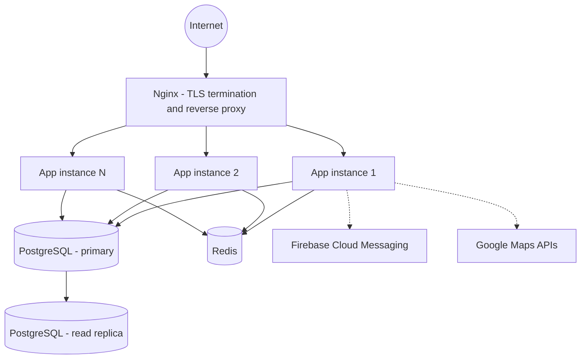

Since the application is stateless (JWT auth, no in-memory session), horizontal scaling is a matter of adding app instances behind Nginx — no sticky sessions required, except WebSocket connections, which are routed with session affinity or backed by a shared Redis pub/sub for multi-instance broadcast.

### 22.3 Environment Variables

Configuration is fully externalized via environment variables consumed by `application-{profile}.yml` (`dev`, `staging`, `prod`), covering: database URL/credentials, Redis connection, JWT signing secret + expiry, FCM service account path, Google Maps API key, CORS allowed origins, and feature flags per subscription plan.

### 22.4 Monitoring & Logging

- **Spring Boot Actuator** exposes health, metrics, and readiness/liveness endpoints for orchestrator health checks.
- **Micrometer** exports metrics (request latency, JVM memory, connection pool saturation) to a metrics backend (Prometheus-compatible, infra-agnostic).
- Structured JSON logs (see [§8.8](#88-logging-flow)) are shipped to a centralized aggregator for search and alerting.
- Alerting thresholds are defined for: error rate spike, P95 latency breach, DB connection pool exhaustion, and failed scheduled job runs.

### 22.5 Backup Strategy

- Automated nightly full backups of PostgreSQL plus continuous WAL archiving for point-in-time recovery.
- Backup restoration is tested on a defined cadence (not just taken and assumed valid) — an untested backup is not a backup.
- `audit_logs` and `attendance_logs` (immutable, append-only tables) are prioritized for the tightest recovery-point objective given their compliance significance.

---

## 23. Sprint Plan

Each sprint below assumes a two-week cadence. Estimated timelines assume a small (3–5 engineer) backend team.

| Sprint | Focus | Objectives | Key Tasks | Deliverables | Acceptance Criteria | Est. Timeline |
|---|---|---|---|---|---|---|
| **1** | Project Setup | Establish foundation | Repo scaffolding per [§9](#9-backend-folder-structure); Docker Compose (Postgres+Redis); Flyway baseline; CI pipeline skeleton; Swagger wired up | Buildable, containerized skeleton app | `docker compose up` succeeds; `/actuator/health` returns 200; empty Swagger UI loads | Week 1–2 |
| **2** | Authentication | Secure login foundation | `employees`, `roles`, `permissions`, `refresh_tokens` migrations; JWT filter chain; login/refresh/logout/forgot-password APIs | Working auth module per [§13](#13-authentication) | All auth endpoints pass integration tests incl. rate-limit and token-rotation cases | Week 3–4 |
| **3** | Employee Management | Core HR hierarchy | `companies`, `branches`, `departments`, `designations`, `employees` CRUD; RBAC enforcement | Employee module per [§14](#14-employee-module) | Full CRUD with tenant isolation verified by cross-tenant-access negative tests | Week 5–6 |
| **4** | Attendance | GPS-verified attendance | `attendance`, `attendance_logs` schema; geofence validation service; check-in/out APIs; auto-checkout scheduler | Attendance module per [§15](#15-attendance-module) | Boundary tests for geofence radius pass; idempotent check-in verified under concurrent requests | Week 7–8 |
| **5** | Leave Management | Structured leave workflow | `leave_types`, `leave_requests`, `leave_balances`, `holidays`; state machine + approval routing | Leave module per [§16](#16-leave-module) | Overlap and balance-exceeded edge cases covered; approval transaction is atomic under concurrency test | Week 9–10 |
| **6** | Task Management | Work assignment & tracking | `tasks`, `task_assignments`, comments/attachments; status derivation logic | Task module per [§17](#17-task-module) | Multi-assignee completion derivation verified; comment threading tested | Week 11–12 |
| **7** | Notifications | Real-time + push delivery | `notifications`, `announcements`, `device_tokens`; WebSocket config; FCM integration; event-driven dispatch | Notification module per [§18](#18-notifications) | Delivery confirmed across both channels in staging; opt-out preferences honored | Week 13–14 |
| **8** | Analytics | Dashboards & reporting | `/dashboard/summary`, trend endpoints, Redis caching layer, `daily_reports` module | Analytics module per [§19](#19-analytics) | Dashboard P95 latency target met under load test; role-scoped data confirmed | Week 15–16 |
| **9** | Testing | Hardening & QA | Full unit/integration/security/performance test suite per [§21](#21-testing); OWASP dependency scan | Test coverage report, security scan report | ≥80% service-layer coverage; zero critical/high vulnerabilities open | Week 17–18 |
| **10** | Deployment | Production readiness | Production Docker images, Nginx config, monitoring/alerting, backup automation per [§22](#22-deployment) | Deployed production environment | Health checks green; alert thresholds firing correctly in a controlled drill; restore-from-backup drill successful | Week 19–20 |

---

## 24. Coding Standards

- **Constructor injection only** — no `@Autowired` field injection, ensuring immutability and straightforward unit testing.
- **No business logic in controllers** — controllers only bind, delegate, and translate results into HTTP responses.
- **DTOs are immutable** (Java `record` types) — request/response objects never carry mutable setters exposed beyond deserialization.
- **Every public service method has a Javadoc** describing its business contract, not just its parameters — future maintainers should understand *why*, not just *what*.
- **No magic strings/numbers** for statuses, roles, or error codes — always reference the enums/constants in `constants/`.
- **Every entity extends `BaseEntity`** for consistent audit columns; no table opts out of `created_at`/`updated_at`/`is_deleted`.
- **N+1 query prevention:** any relationship fetched in a list endpoint must use an explicit `@EntityGraph` or fetch-join query — lazy-loading in a loop is treated as a code review blocker.
- **All mutating endpoints require an idempotency consideration** — either natural idempotency (unique constraints) or explicit client-supplied idempotency keys (as in the offline sync API).
- **Package-by-feature over package-by-layer is avoided at the top level** in favor of the layered structure in [§9](#9-backend-folder-structure) for team-wide consistency, but each layer's internal files are still grouped by domain (e.g., `controller/attendance/`, `controller/leave/`) once the codebase grows past a handful of controllers per layer.

---

## 25. Git Workflow

- **Branching model:** trunk-based development with short-lived feature branches (`feature/leave-approval-flow`, `fix/geofence-boundary-bug`), merged via Pull Request — no long-lived `develop` branch to avoid merge drift.
- **Commit convention:** Conventional Commits (`feat:`, `fix:`, `refactor:`, `test:`, `docs:`, `chore:`) to enable automated changelog generation.
- **PR requirements:** minimum one approving review, all CI checks green (build, unit tests, integration tests, dependency scan), and — for any change touching a table in [§10](#10-database-design) or an endpoint in [§12](#12-api-documentation) — this README updated in the same PR, since it is the source-of-truth blueprint, not a stale artifact.
- **Release tagging:** semantic versioning (`vMAJOR.MINOR.PATCH`); every tagged release exports its OpenAPI spec into `docs/openapi/` for historical contract reference.
- **Migration discipline:** Flyway migrations are strictly append-only and numbered sequentially (`V24__add_task_priority_index.sql`); a merged migration is never edited — a mistake is corrected by a new forward migration, preserving a reproducible schema history across every environment.

---

## 26. Future Enhancements

| Enhancement | Rationale |
|---|---|
| **Payroll integration** | Attendance/overtime data (already captured) feeds naturally into a payroll calculation module or third-party payroll API integration |
| **Polygon-based geofencing** | Circular radius geofencing (current design) is simple but imprecise for irregularly shaped campuses; a `PostGIS`-backed polygon geofence is a natural evolution behind the existing Strategy pattern (see [§8.3](#83-design-patterns--principles-applied)) |
| **Materialized analytics tables** | As documented in [§19.2](#192-computation-strategy), nightly pre-aggregation should be introduced once live-query cost crosses a defined threshold |
| **Microservice extraction** | The modular monolith boundaries in [§9](#9-backend-folder-structure) are drawn so Notifications or Analytics could be extracted into standalone services without a rewrite, if independent scaling becomes necessary |
| **Biometric/face-verification check-in** | Optional additional fraud-prevention layer alongside GPS, using the existing `photo_url` field already present in `attendance_logs` |
| **Multi-language support (i18n)** | Notification/announcement content and validation error messages are candidates for localization as the platform expands to new markets |
| **Advanced approval chains** | Multi-level leave approval (e.g., Manager → HR → Director for extended leave) beyond the current single-approver model |
| **SSO / SAML / OAuth2 login** | For enterprise customers wanting to federate identity with their own IdP, alongside the existing password-based login |

---

*End of document. This README is the authoritative backend blueprint for WorkTrack Pro and should be kept in sync with the codebase per the Git Workflow policy in [§25](#25-git-workflow).*
